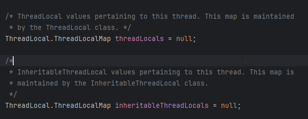

### ThreadLocal이란?
결론적으로 말하면 Java에서 제공하는 스레드에 로컬 변수를 저장할 수 있게 해주는 객체이다.



`Thread.java` 파일을 보면 다음과 같은 내용을 볼 수 있다.
이를 통해 알 수 있는 점은 ThreadLocal은 스레드 별로 가지는 독립적인 멤버란 뜻이다. ThreadLocal은 ThreadLocalMap을 통해서 관리되며, ThreadLocalMap은 key-value 저장소로 key에 ThreadLocal 객체가 해당되고, value에는 해당 스레드에서 저장되는 값이 들어간다.

---

### 그럼 왜 필요할까?

궁극적인 목적은 스레드 별로 **독립적**으로 데이터를 저장해 스레드 별로 안전하게 데이터를 저장하기 위해서이다.
- 다른 스레드의 개입을 방지

좀 더 자세히 알아보면, 다음과 같은 사용 사례들이 있다.

#### MDC
멀티스레드 기반인 Springboot는 thread-per-request로 동작한다. 각 요청마다 담당자인 스레드가 붙어서 진행하는 것이다.

그럼 이제 동시에 여러 요청이 오는 상황에서, 각 스레드들이 요청을 처리하는 로그를 남기면 다음과 같을 것이다.

```
2025-08-19 10:15:01.101  INFO [http-nio-8080-exec-3] c.e.demo.controller.HomeController rid=a17c2 - GET /api/login 호출
2025-08-19 10:15:01.105  INFO [http-nio-8080-exec-1] c.e.demo.controller.HomeController rid=bb932 - GET /api/users 호출
2025-08-19 10:15:01.108  INFO [http-nio-8080-exec-2] c.e.demo.controller.HomeController rid=cf9a1 - GET /api/orders 호출
2025-08-19 10:15:01.120  INFO [http-nio-8080-exec-1] c.e.demo.service.UserService      rid=bb932 - 사용자 목록 조회 시작
2025-08-19 10:15:01.123  INFO [http-nio-8080-exec-3] c.e.demo.service.AuthService      rid=a17c2 - 사용자 인증 시도: user=jongha
2025-08-19 10:15:01.130  INFO [http-nio-8080-exec-2] c.e.demo.service.OrderService     rid=cf9a1 - 주문 목록 조회 시작
2025-08-19 10:15:01.145  INFO [http-nio-8080-exec-3] c.e.demo.service.AuthService      rid=a17c2 - 인증 성공: user=jongha
2025-08-19 10:15:01.187  INFO [http-nio-8080-exec-1] c.e.demo.service.UserService      rid=bb932 - 사용자 목록 조회 완료 (3명)
2025-08-19 10:15:01.210  INFO [http-nio-8080-exec-2] c.e.demo.service.OrderService     rid=cf9a1 - 주문 목록 조회 완료 (5건)
2025-08-19 10:15:01.211  INFO [http-nio-8080-exec-4] c.e.demo.controller.HomeController rid=d4f3b - POST /api/payments 호출
2025-08-19 10:15:01.215  INFO [http-nio-8080-exec-4] c.e.demo.service.PaymentService   rid=d4f3b - 결제 처리 시작: user=hong, amount=12000
2025-08-19 10:15:01.320  INFO [http-nio-8080-exec-4] c.e.demo.service.PaymentService   rid=d4f3b - 결제 승인 완료: 승인번호=TX-9982
```

여러 스레드들의 로그가 뒤섞여 특정 사용자의 로그만 보고 싶을 때는 쉽지 않은 상황이다. 이러한 로그 모니터링을 개선하기 위한 것이 MDC이다. MDC는 **멀티스레드 환경에서 스레드 별 로그를 추적하기 위한 기능**으로, 내부적으로 ThreadLocalMap을 사용하여 이를 구현한다. ThreadLocal에 요청의 메타정보를 담고, 이를 로그로 출력하는 방법을 사용한다. MDC에 대한 자세한 얘기는 다음 포스팅에...

#### Spring Transaction
Spring은 DB와 커넥션을 열 때, `DataSourceUtil`의 `doGetConnection` 메서드에서 `TransactionSynchronizationManager`를 커넥션 객체를 저장한다. 그리고 이 `TransactionSynchronizationManager`는 바로 ThreadLocal을 통해 구현되어 있다.


커넥션 객체를 ThreadLocal에 저장하는 이유는 현재 커넥션을 가져온 스레드만 커넥션 사용을 제한해, 다른 스레드가 이를 간섭하지 못하게 하기 위함이다. 즉, 한 스레드에서 트랜잭션을 유지하기 위함이다.

---
### 주의점
Tomcat은 스레드풀 방식으로 동작한다. 이때 스레드가 스레드풀에 반환될 때 ThreadLocal의 값이 남아있는 채로 돌아간다. 만약, 민감정보가 들어있으면 추후에 스레드가 재사용되면서 보안적인 문제를 일으킬 수도 있고, 특정 키에 대한 값이 남아 데이터 정합성 문제를 일으킬 수도 있다.

그렇기에 ThreadLocal을 사용한 뒤 **초기화**해주는 작업이 반드시 필요하다.